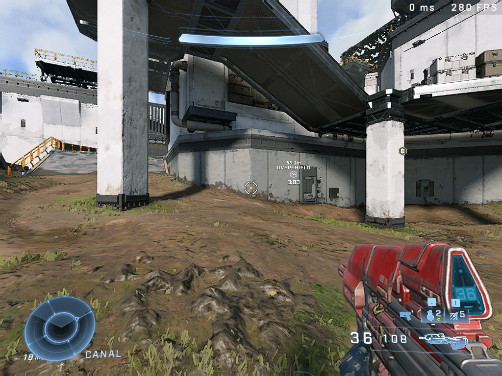

#  Modifications
This section covers about modifications for the game that can potentially either help to fix certain technical issues, improve performance or provide QOL features.
> [!CAUTION]
> **One major concern for many would be that the Arbiter Anticheat will kick in and issue punishments.**<br>
> **The following modifications which have been listed here, have been tested and work totally fine with the anticheat.**<br>
> **It is advised to use the following with caution and at your own risk.**<br>
> **If you still have concerns about this, avoid this page entirely.**


## [Special K](https://github.com/SpecialKO/SpecialK)
Special K is an extension game modifying framework for indepth tweaking of games.<br>
This provides a feature rich toolset which can cater in accordance of your needs.

## Installation
There are 2 installation methods:

### 1. [SKIF (Special K Injection Frontend)](https://wiki.special-k.info/SpecialK/Global#technical-info)
> [!IMPORTANT]
> **Supported Platforms**
> - [x] Steam
> - [x] Microsoft Store

### 2. [Local Install](https://wiki.special-k.info/en/SpecialK/Local) **(⭐ Recommended)**
> [!IMPORTANT]
> **Supported Platforms**
> - [x] Steam
> - [ ] Microsoft Store

> [!CAUTION]
> SKIF's doesn't exclusively inject into games but rather into any process that uses a graphics API and deals with input which means it could potentially trigger anticheats in other games.<br>
> As mentioned at the beginning of this section **as far as Halo Infinite is concerned the Arbiter Anticheat will not kick in when Special K is being used which also applies to [ZetaLoader](#zetaloader)**.<br>
> Because of this it is recommended to use a Local Install of Special K exclusively for instances of Halo Infinite.<br>
>
> Read More: https://wiki.special-k.info/SpecialK/Global#technical-info

### Features
Since Special K has an expansive feature set, this section will only be concerned with useful features for Halo Infinite.


> If you want to check or mess with settings within Special-K check out its [wiki](https://wiki.special-k.info).

> [!WARNING]
> Changing certain settings within Special K could potentially impact performance or cause undefined behavior in the game. <br>
> Because of this, consider referring to Special K's wiki beforehand on a specific feature.


#### NVIDIA Reflex
With Special K, it is possible to use NVIDIA Reflex with Halo Infinite.<br>
Refer to [Special K's wiki page on its NVIDIA Reflex implementation](https://wiki.special-k.info/en/Advanced/Video#nvidia-reflex) for more information.

#### Framerate Limiter
Special K provides a superior framelimiter which provides optimal frame pacing and timing consistency.<br>
Refer to [Special K's wiki page on its Framerate Limiter](https://wiki.special-k.info/en/Advanced/Video#frame-rate-limiter) for more information.

#### Latent Sync
Latent Sync provides a tear free experience without the need of G-Sync, FreeSync or even V-Sync.
What you are getting here is essentially software based adaptive sync.

Refer to [Special K's wiki page on Latent Sync](https://wiki.special-k.info/en/Advanced/Video#latent-sync).

## [ZetaLoader](https://github.com/Aetopia/Zetaloader)
> [!IMPORTANT]
> **Supported Platforms**
> - [x] Steam
> - [ ] Microsoft Store

### Features

A tiny and open source modification/patch for Halo Infinite that aims to fix and improve some aspects of the game which include:<br>

1. Borderless Fullscreen:<br>
    Fixes issues with the game's borderless fullscreen implementation not filling the screen correctly at certain resolutions.

    > [!WARNING]
    > **Due to the way, how ZetaLoader implements Borderless Fullscreen, the following options will not work properly**:
    >
    > |Setting|
    > |-|
    > |Display Monitor|
    > |Limit Inactive Framerate|
    > |Inactive Mute|
    > |V-Sync|
    > |Maximum Framerate|
    >
    > Because of this, consider using alternatives for the options listed here:
    >
    > |Setting|Alternative|
    > |-|-|
    > |V-Sync|Driver Based V-Sync|
    > |Maximum Framerate| External Framerate Limiter|
    > |Limit Inactive Framerate| Background Application Max Frame Rate (**NVIDIA Only!**)|

2. Jittery Mouse Input Fix:

    Fixes jittery mouse input when an external framerate limiter is used.

    > [!NOTE]
    > Setting the game's process priority to `HIGH` will negate this fix.   
    >     
    > Reference: https://learn.microsoft.com/en-us/windows/win32/procthread/scheduling-priorities
    > 
    > Issue + Fix Demonstration: https://www.youtube.com/watch?v=4pJd-dKW7WY  


3. User Specified Display Mode:
    > [!NOTE]
    > User Specified Display Mode in Action: https://www.youtube.com/watch?v=FnzN4xTO6UA

    User Specified Display Mode provides Halo Infinite with the facility to have the game's window run at any arbitrary display mode of the user's choice as long as it is valid.

    - **1024x768 with ZetaLoader along with Aggressive Dynamic Resolution Scaling.**
        

    - **1024x768 with Visual Quality Tweaks and ZetaLoader along with Aggressive Dynamic Resolution Scaling.**
        

    > [!NOTE]
    > - ZetaLoader's Borderless Fullscreen implementation must be enabled to use this feature.
    > - Make sure to adjust **`Text Size`** setting to adjust the HUD size, depending on the display resolution.
    > - In your GPU's Driver Control Panel:<br>
    >    - Set the Scaling Mode to "Fullscreen" or "Stretched".
    >    - Use GPU Scaling for faster display mode switches.
    > - User Specified Display Mode handles display modes as follows:<br>
    >   -  Only Landscape orientation based display modes can be used.
    >   -  If no display mode is specified, the default display mode or display mode stored in the Windows Registry will be used.

> [!NOTE]
> For more information on the project, view ZetaLoader's GitHub repository.<br>
    **GitHub Repository: [https://github.com/Aetopia/Zetaloader](https://github.com/Aetopia/Zetaloader)**

### Installation 
1. Download the latest version of ZetaLoader from [GitHub Releases](https://github.com/Aetopia/ZetaLoader/releases/latest).
2. Open Halo Infinite's installation directory.
3. To install ZetaLoader for the campaign and multiplayer, place the dynamic link library in the following folders:<br>

    > [!NOTE]
    > Since Halo Infinite's campaign and multiplayer are separated both required their own copy of ZetaLoader.
    > - Multiplayer: `"<Installation Directory>\game"`
    > - Campaign: `"<Installation Directory>\subgames\CampaignS1"`

### Uninstallation
Simply remove `dpapi.dll` from Halo Infinite's Installation directory for the campaign and multiplayer.

### Configuration
To configure ZetaLoader, do the following:


> You must restart the game for any configuration file changes to reflect.

1. Go to the following directory: `"%LOCALAPPDATA%\HaloInfinite\Settings"`.
2. Create a new file called `ZetaLoader.ini`, this is ZetaLoader's configuration file.
3. Add the following contents into the file:<br><br>
    ```ini
    [Settings]
    WindowMode = 0 
    Width = 0
    Height = 0
    RefreshRate = 0
    ```

    |Key|Value|
    |-|-|
    |`WindowMode`|Borderless Fullscreen<br><ul><li>`0` - Disabled</li> <li>`1` - Enabled</li></ol>|
    |`Width`|Display Resolution Width|
    |`Height`|Display Resolution Height|
    |`RefreshRate`|Display Refresh Rate|

Example:
```ini
[Settings]
WindowMode = 1
Width = 1360
Height = 768
RefreshRate = 60
```
This will make Halo Infinite run `1360`x`768` @ `60` Hz with ZetaLoader's Borderless Fullscreen enabled.

## Frequently Asked Questions
- **Can I use Special K and ZetaLoader together?**<br>
    You can use both modifications hand in hand but it not **recommended** due to the following reasons:
    - ZetaLoader's Borderless Fullscreen will override any window or display management settings configured through Special K.
    - The settings of the monitor, the game is running on might be altered if any display settings are changed within Special K.

    If you want to use both modifications then simply ensure you don't use ZetaLoader's Borderless Fullscreen or alter any window or display management settings within Special K.

- **Special K has more features so what's the point of ZetaLoader?**<br>
    As a fun fact, during ZetaLoader's development it was originally suppose to be used alongside Special K itself.<br> 
    But this idea was quickly ditched due to the complications of compatibility of using Special K.<br>
    With ZetaLoader being to able to function as a standalone modification this allows for it implement things as it sees fit.
    
    
    
