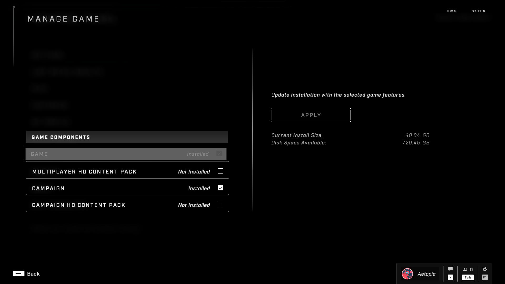

# Performance
This section is concerned with maximizing in game performance with no concern for graphical fidelity.

Check [Visual Quality Tweaks](Visual-Quality-Tweaks.md) for graphical fidelity tweaks.

## Optimize In Game Settings
> [!IMPORTANT]
> **Supported Platforms**
> - [x] Steam
> - [x] Microsoft Store

Simply do the following:
1. Set your settings preset to `Low`.
2. If there are any UI/Visual Graphical options that can turned off, **turn them off!**

## Removal of High Resolution Texture Packs
> [!IMPORTANT]
> **Supported Platforms**
> - [x] Steam
> - [x] Microsoft Store

The High Resolution Texture Packs ship with the game are know to cause stuttering & performance issues.

1. On the title screen, go to the Control Panel.
2. Select "Manage Game" from the Control Panel.
3. Make sure the only thing that is select is the Campaign, if you own it.
4. Finally hit <kbd>**Apply**</kbd> to apply the changes.

 

## Aggressive Dynamic Resolution Scaling

> [!IMPORTANT]
> **Supported Platforms**
> - [x] Steam
> - [x] Microsoft Store

> [!NOTE]
> You may refer to [Visual Quality Tweaks](#visual-quality-tweaks) to fix any quality issues caused by aggressive dynamic resolution scaling.

We may abuse the `Minimum Framerate` option for better performance.
By setting the value to `960` FPS, dynamic resolution scaling becomes insanely aggressive providing noticable performance gains.

1. Open the `SpecControlSettings.json` file depending on your platform:<br>

    |Platform|Filepath|
    |-|-|
    |Steam|`%LOCALAPPDATA%\HaloInfinite\Settings\SpecControlSettings.json`|
    |Microsoft Store|`%LOCALAPPDATA%\Packages\Microsoft.254428597CFE2_8wekyb3d8bbwe\LocalCache\Local\HaloInfinite\Settings\SpecControlSettings.json`|

2. Set the following key-value pair to the following:<br>
    ```js
    "spec_control_minimum_framerate": {
        "version": 2,
        "value": 960
    },
    "spec_control_target_framerate": {
        "version": 1,
        "value": 960
    } 
    ```
    **Make sure to set the in game sharpness to 100% for visiblity.**

3. Results:
    - **No Minimum Framerate**<br>
        
    - **Minimum Framerate**<br>
        
