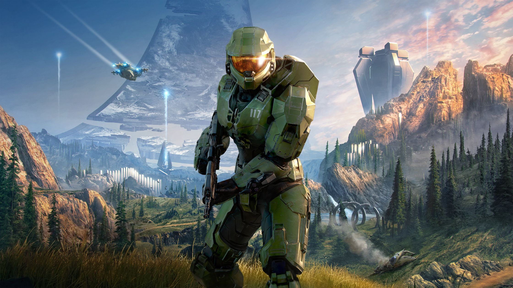

<h1 align="middle">
    
    Halo Infinite PC Guide
</h1> 

<b>

This guide aims to document any information that can improve or enhance the Halo Infinite PC Experience.

</b>

<h2>
Index
</h2>

|Index|Page|Description|
|-|-|-|
|1|[Performance](Pages/Performance.md)|This section is concerned with maximizing in game performance with no concern for graphical fidelity.|
|2|[Visual Quality Tweaks](Pages/Visual-Quality-Tweaks.md)|This section is concerned with providing tweaks that can help to enhance the graphical fidelity of the game.|
|3|[Modifications](Pages/Modifications.md)|This section covers about modifications for the game that can potentially either help to fix certain technical issues, improve performance or provide QOL features.|

